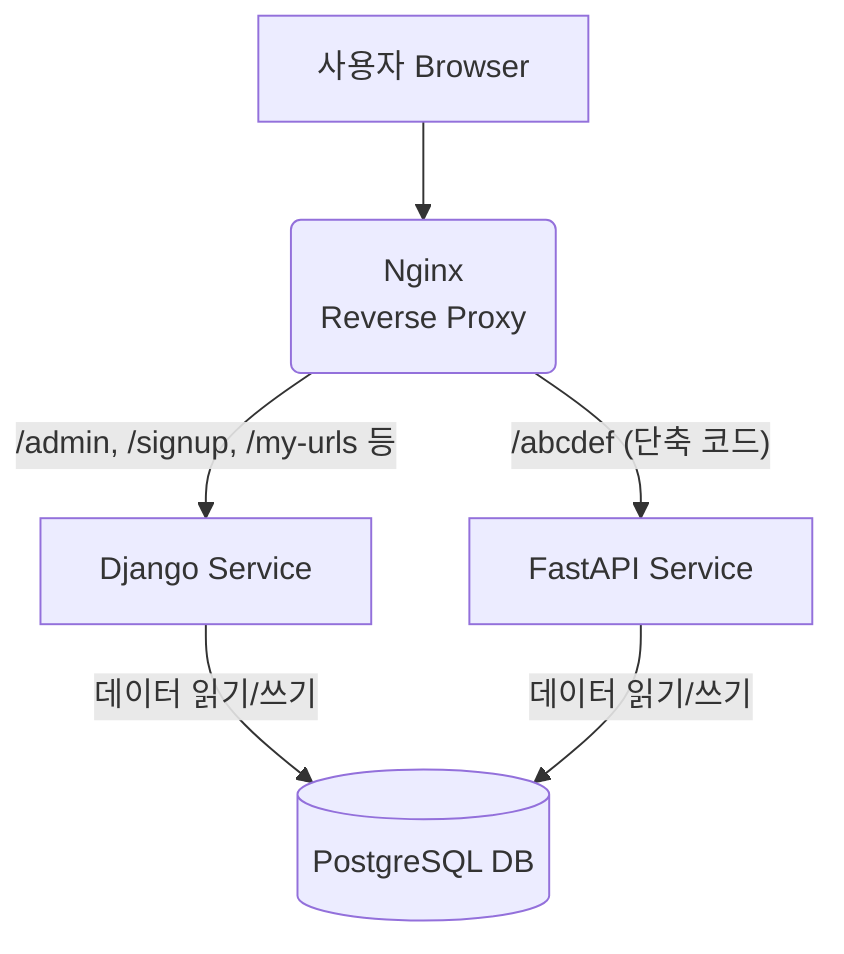

# Django + FastAPI URL Shortener

Python(Django, FastAPI)과 Docker 기반의 마이크로서비스 아키텍처(MSA)를 학습하고 구현한 URL 단축기 프로젝트입니다.

## 🚀 프로젝트 개요 (Project Overview)

이 프로젝트는 현대적인 웹 애플리케이션 아키텍처를 학습하기 위해 시작되었습니다. 각기 다른 강점을 가진 두 개의 Python 웹 프레임워크를 조합하고, 전체 시스템을 Docker를 통해 컨테이너화하여 관리합니다.

- **Django:** 사용자 인증, 관리자 페이지, URL 데이터 관리 등 복잡하고 안정성이 중요한 비즈니스 로직을 담당합니다.
- **FastAPI:** 단축 URL 리디렉션 및 클릭 카운트처럼 빠르고 높은 성능이 요구되는 API 엔드포인트를 비동기적으로 처리합니다.
- **Nginx:** 리버스 프록시로서 외부의 모든 요청을 받아, 경로에 따라 적절한 서비스(Django 또는 FastAPI)로 라우팅하는 관문 역할을 합니다.
- **PostgreSQL:** 모든 데이터를 안정적으로 저장하고, 두 서비스가 공유하는 중앙 데이터베이스 역할을 합니다.
- **Docker & Docker Compose:** 위 모든 서비스를 격리된 환경에서 일관성 있게 실행하고 관리합니다.

## 🏛️ 시스템 아키텍처 (Architecture)



## ✨ 주요 기능 (Features)

- **사용자 인증:** 회원가입, 로그인, 로그아웃 기능
- **URL 단축:** 로그인한 사용자는 자신만의 단축 URL 생성 가능
- **대시보드:** 사용자는 자신이 생성한 URL 목록과 클릭 횟수 조회 가능
- **리디렉션:** 단축 URL 접속 시 원래 URL로 고성능 리디렉션
- **클릭 카운트:** 단축 URL이 클릭될 때마다 횟수 증가
- **관리자 페이지:** Django Admin을 통한 전체 데이터 관리

## 🛠️ 기술 스택 (Tech Stack)

- **Backend:** Python, Django, FastAPI
- **Database:** PostgreSQL
- **Infrastructure:** Docker, Docker Compose, Nginx

## 🏁 시작하기 (Getting Started)

이 프로젝트를 로컬 환경에서 실행하는 방법입니다.

### 사전 요구 사항

- [Docker](https://www.docker.com/products/docker-desktop/)
- [Git](https://git-scm.com/)

### 실행 방법

1.  **레포지토리를 복제합니다.**
    ```bash
    git clone [https://github.com/사용자이름/django-fastapi-url-shortener.git](https://github.com/사용자이름/django-fastapi-url-shortener.git)
    cd django-fastapi-url-shortener
    ```

2.  **Docker Compose를 사용하여 모든 서비스를 빌드하고 실행합니다.**
    ```bash
    docker-compose up --build -d
    ```
    * `-d` 옵션은 컨테이너를 백그라운드에서 실행합니다.

3.  **데이터베이스 마이그레이션을 적용합니다.**
    ```bash
    docker-compose exec django python3 manage.py migrate
    ```

4.  **관리자 계정(슈퍼유저)을 생성합니다.**
    ```bash
    docker-compose exec django python3 manage.py createsuperuser
    ```
    * 터미널의 안내에 따라 사용자 이름, 이메일, 비밀번호를 입력해주세요.

5.  **서비스에 접속합니다.**
    * 메인 페이지: [http://localhost](http://localhost)
    * 관리자 페이지: [http://localhost/admin](http://localhost/admin)

### 사용 방법

- [http://localhost/signup](http://localhost/signup) 페이지에서 회원가입 후 로그인합니다.
- 로그인 후 [http://localhost/my-urls](http://localhost/my-urls) 페이지에서 새로운 URL을 단축하고 목록을 관리할 수 있습니다.

### 서비스 종료

```bash
docker-compose down
```

## 📝 앞으로의 개선 과제 (To-Do)

- [ ] API 인증(JWT)을 통한 보안 강화
- [ ] 생성된 단축 URL 수정 및 삭제 기능 구현
- [ ] 프론트엔드를 React/Vue.js 같은 SPA로 분리
- [ ] 비동기 작업(Celery)을 이용한 통계 분석 기능 추가
- [ ] 테스트 코드(Pytest) 작성
